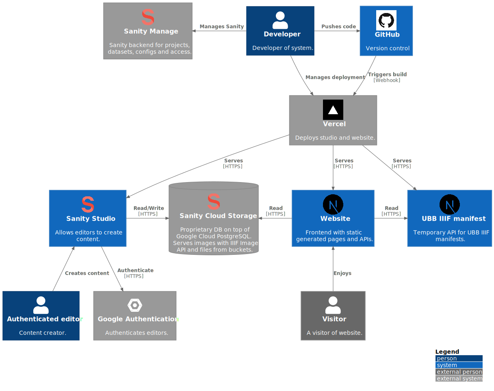
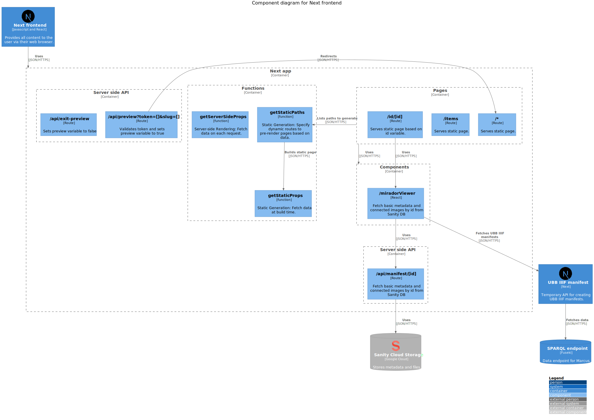

# Decriminalizing history

*Decriminalizing history* software architecture. The architecture, will be called *Muna* for the rest of the documentation. 

It is documented using the [C4 model](https://c4model.com/).

## Context

Software architecture overview.

## Container

Software systems that makes up the whole Muna software architecture.

The repository contains the Next.js framework with a `studio` folder. `studio` contains the code for running the [Sanity Studio](https://www.sanity.io/docs/sanity-studio).

### Studio

The Studio is a React Single Page Application. It is Open Source and can be customized with plugins and React components. 
The `studio` installs the datamodel or the schemas by installing `@seidhr/sanity-plugin-muna-schemas`.

The Studio have one major custom plugin. The `import-tool` is a "tool" for searching skeivtarkiv.no, marcus.uib.no, NB.no and kulturnav.org. Objects or authority data can be imported to the Studio where they can be referred to in texts and other documents.

The database is not Open Source and runs in the Google Cloud. The Studio communicates with the backend via an API. It is not necessary to run a local database when developing.

#### Component

Documentation of custom Studio plugins.

### Sanity Manage

[Sanity Manage](https://www.sanity.io/manage)

### Web

`web` contains a [Next.js](https://nextjs.org/) application. Next.js was chosen because it supports SSR, SSG and client side rendering and lets the app combine all three strategies.

<!-- 
 -->

#### Component

<!-- 
## Deployment

WIP!

### Vercel 

 -->

## TODO! Schema upgrade strategy

The main reason for having the schemas as an external library is to facilitate a data migration strategy. Every version of the schema must be accompanied by a migration script. Nothing revolutionary.

